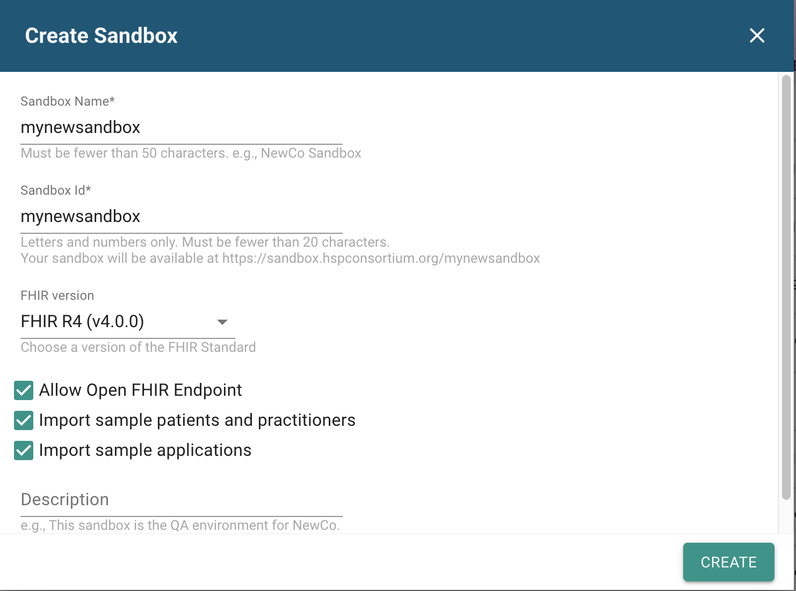
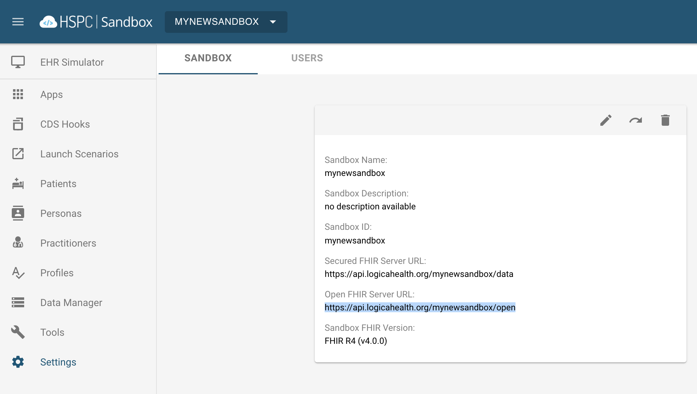
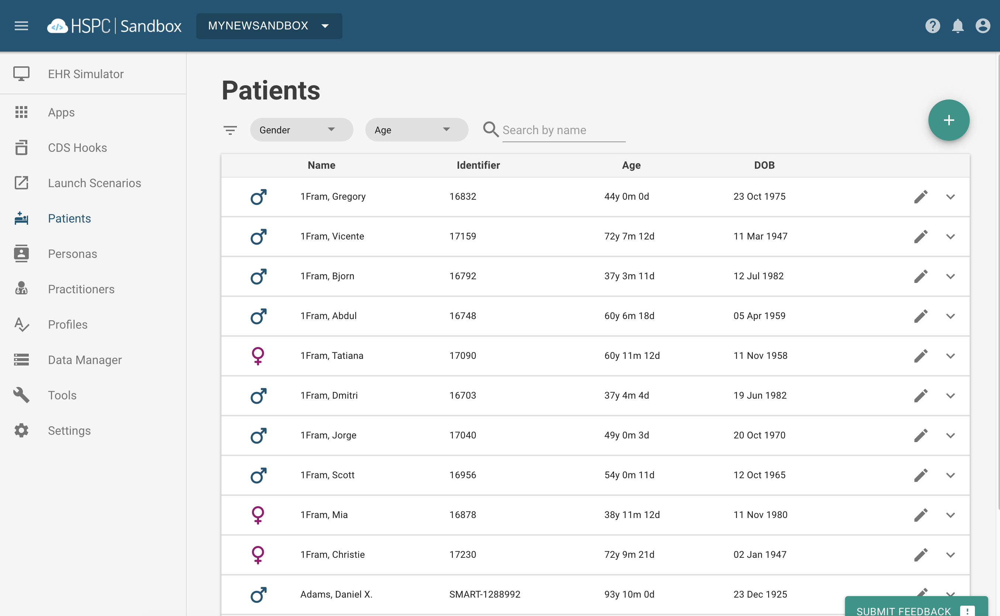
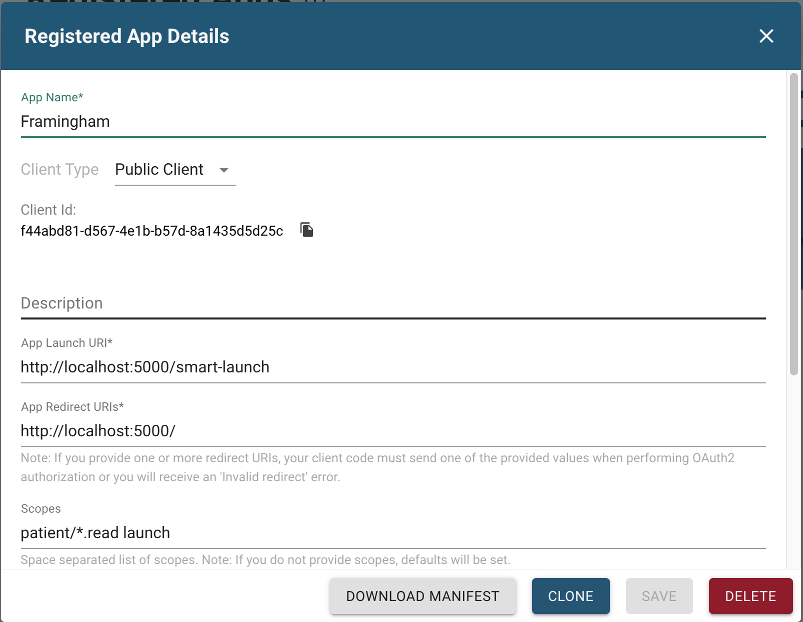
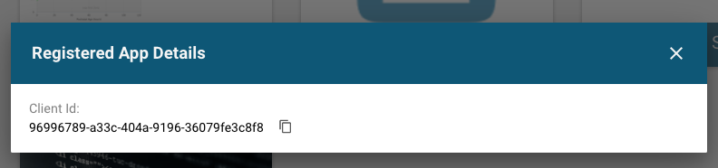
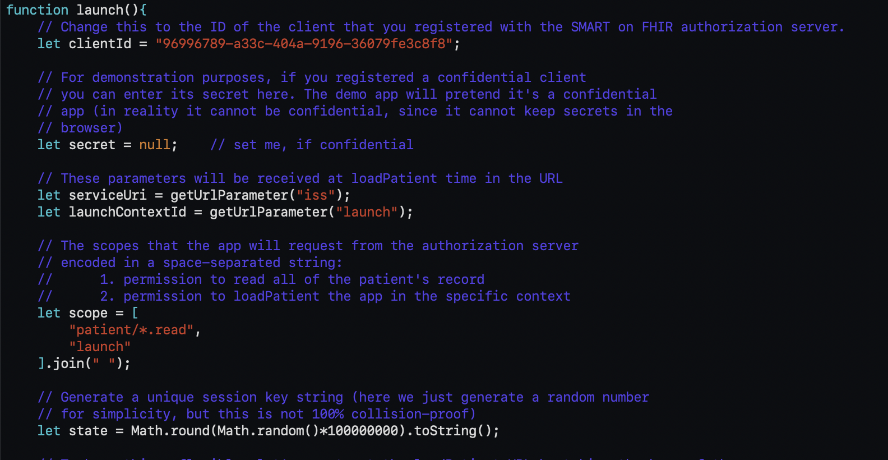

# Framingham App - SMART
This is a SMART-enabled template for the Framingham Risk Calculator in the FHIR Education package.
* Risk equations come from https://www.mdcalc.com/framingham-risk-score-hard-coronary-heart-disease#evidence
* Docker/Node server file architecture adapted from https://github.com/cerner/cds-services-tutorial/wiki

## Instructions
This example uses a Docker container to house the dependencies necessary for the service. Follow this
[guide](https://docs.docker.com/install/) to install Docker on your machine and check installation success with
<code>docker -v</code>. Then follow this [guide](https://docs.docker.com/compose/install/) to install Docker Compose
and check that installation with <code>docker-compose -v</code>.

To run the example, navigate to the root directory of the repository and use
<code>docker-compose up --build</code>

Follow the instructions below to create an environment where a SMART launch can be performed to view this example. SMART apps are meant to be deployed in an environment which uses an authentication server. SMART uses
OAuth 2.0 which requires access tokens from the authentication server in order to query the data server for patient
information.

The environment we will use for this app is the [HSPC Sandbox](https://sandbox.hspconsortium.org/)

#### Setting up an environment
<b>--Skip this step if you created a sandbox for the query activity--</b>
1. Create an account, confirm email, etc.
2. Select "New Sandbox", enter a specific name, select FHIR version R4, and check each box to allow an open endpoint for your queries as well as the importing of sample applications and sample patients and practitioners.

3. Go to "Settings" and copy the <i>Open FHIR Server URL</i> of your sandbox.

#### Transferring test patients to sandbox
The Framingham calculator requires patients with specific data points. This means we'll need to import patients from another server. To do this, we will use a Python file called <i>transfer-to-hspc.py</i>. This file requires the open endpoint you
copied. Ensure Python is installed on your system and then run the following command:
  >python transfer-to-hspc.py <i>the-open-endpoint-of-your-sandbox</i>

It will transfer 10 new patients to your sandbox which have the data fields needed for the Framingham calculator. Check to
verify that they transferred properly by clicking "Patients" and looking for 10 patients with the last name "1Fram". These will be our test patients for the examples.

#### Registering the app with your sandbox
Select "Apps" and click the (+) button to add an app. Choose to create the app manually.
* The Launch URI allows our app to obtain the necessary access tokens to perform the SMART launch.
* The Redirect URI then navigates to the main page of our app.
* Scopes tell the sandbox how much access each app is granted.
* We will register our app to have permissions to launch and to read all data for a patient. Ignore the option to add a sample
patient and keep the other options at their defaults. It should look like the following:

<b>IMPORTANT</b> - Once you click "Save", you will be given a Client Id. Make sure you copy this.

Open the file <i>public/js/launch-smart.js</i> and paste the Client Id in its place at the top of the file, as shown below:

#### Launching the app
* Go back to the "Apps" view and launch the app.
* Select one of the "1Fram" patients.
* Click "Authorize" on the page returned by the authentication server to redirect to the app.
