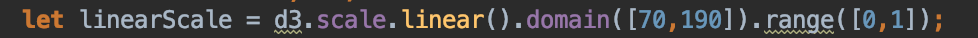

# Framingham app - Final

This is functionally identical to the previous examples but has a more polished front-end design.

Front-end design for Starter, SMART, and Hooks examples:

Front-end design for this example:

That means that this example has all of the same FHIR parsing code as the <i>framingham-app-starter</i> project, the same
SMART authentication code as the <i>framingham-app-SMART</i> project, and the same CDS-Hooks server endpoints as the
<i>framingham-app-hooks</i> project.

For that reason, this README won't duplicate setup instructions. The easiest approach would be to consult the [README](https://github.com/VietDNguyen/FHIR_Education/blob/master/framingham/framingham-app-hooks/README.md) of
the <i>framingham-app-hooks</i> project.

This document will primarily explain our approach to adding the front-end design.

#### Bootstrap
A common approach to front-end design for those who are not very experienced with it is to reuse open-source code which
is similar to what you are trying to achieve. One widely-used collection is called Bootstrap. There are fully built themes
available for purchase or a large collection of components which are free to use.
The latter can be found [here](https://getbootstrap.com/docs/4.0/examples/).

The Framingham app just needs to display values that we pulled from the patient's medical records along with the
calculation result. However, some of these values have useful reference ranges that we could utilize with some sort of
visualization. We decided that Bootstrap's "Album" example was a good base that we could modify to display the patient
information with a few visualizations.

Once you find a good example you want to start with, you should copy the html file of that example from the Bootstrap source
code into your project. It can be found in the Bootstrap [source](https://github.com/twbs/bootstrap/archive/v4.0.0.zip)
download which we included in this project as <i>bootstrap-4.0.0 2</i>. The location of the examples is
<i>bootstrap-4.0.0 2/docs/4.0/examples</i>. We copied the html and css files for the example into our project.

There is a lot in the file that will need to be deleted or modified. Also, any file dependencies can be found in the
<i>bootstrap-4.0.0 2</i> folder. For example, we had to copy in the <i>bootstrap.css</i> file in order for the
album example to display properly. It was in the <i>bootstrap-4.0.0 2/dist/css</i> folder.

#### Visualizations
It's safe to say that if you have an idea for a data visualization, chances are that it's already been done by someone else.
Sometimes, it is more complicated to try to decipher code that someone else wrote. However, sometimes it saves a lot of
frustration. Our initial idea for the visualizations was to have a scale that looked something like a speedometer which
could show low, medium, and high ranges for systolic BP, total cholesterol, and HDL cholesterol.

After some searching, we found [this](https://codepen.io/oildexUX/pen/LZVLEo) CodePen (a widely-used forum for sharing
code snippets) which looked pretty close to what we were imagining. It uses the D3 JavaScript library.

#### D3
D3 is a JavaScript library which is popular when creating visualizations. Each JS library does things a bit differently.
For example, selecting a DOM element with standard JS looks like: <code>document.getElementByID('my-div')</code> while
selecting with D3 look like: <code>d3.select('#my-div')</code>.

Usually, to use D3 in your project, you would either download the source from the [D3 home site](https://d3js.org/) and
link to the right file within that downloaded file, or include a link to the file as hosted on the D3 site, such as:
<code>\</code> in the \<head> section of our HTML file.

However, this CodePen uses D3 version 3, not 5. We will just use the same \<script> link that they use.

#### Tailoring the visualization code

The code which makes the visualizations was first copied into the <i>visualizations.js</i> file in this project. Then we
stripped it down, changed the colors, and changed the size of the sections as documented in that file.

We also used the D3 linear scale function to scale down our patient measurements to fit on a scale from 0 to 1. It looks like:

In this instance, domain is the low and high values we would expect to see in the Systolic Blood Pressure values for
patients. We are telling this function to convert any value in that domain to a corresponding value in the range of 0-1.
