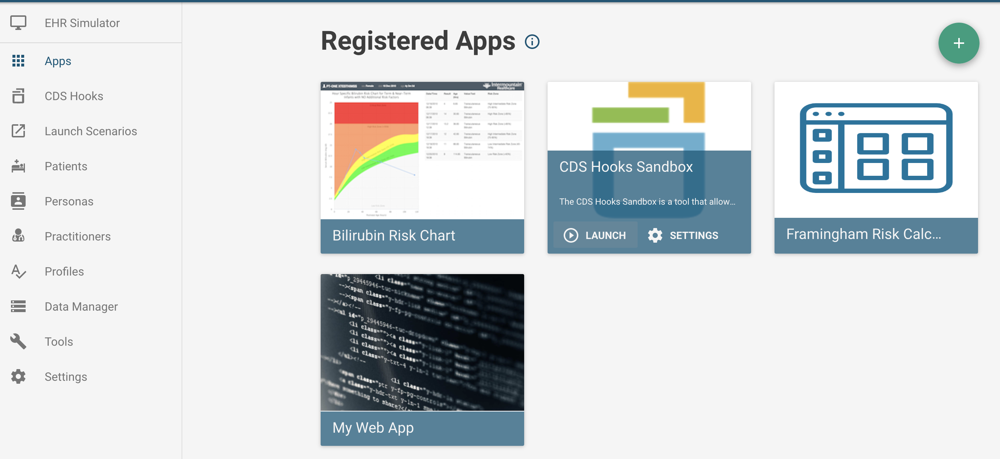
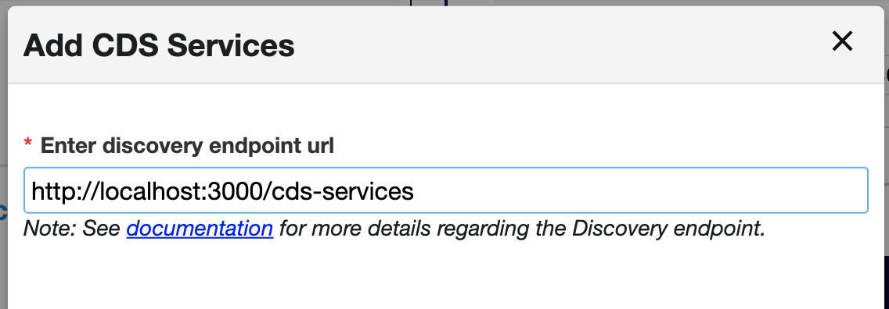
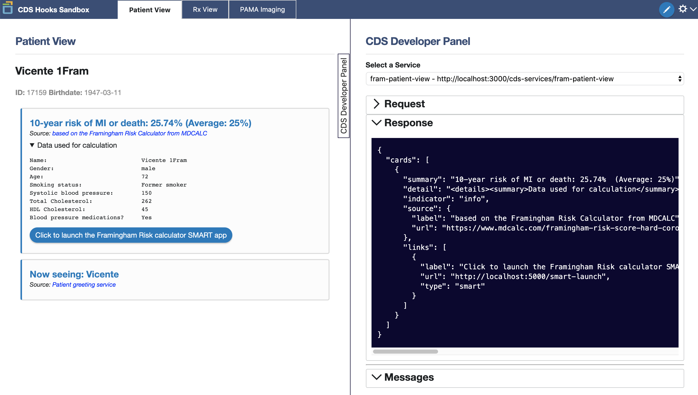
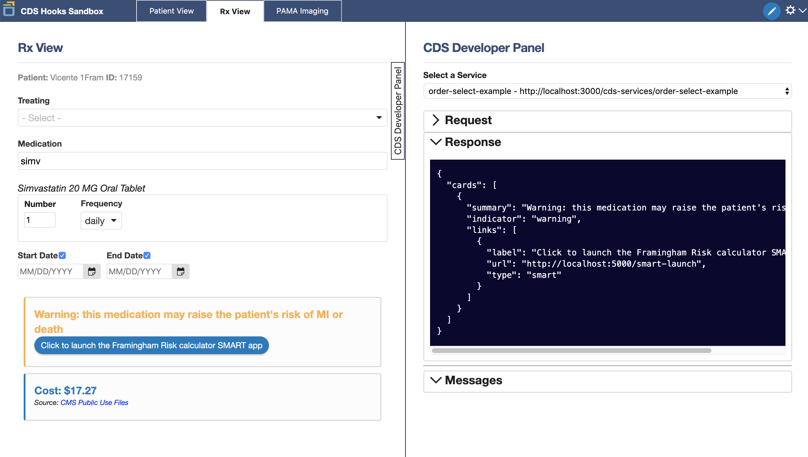

# Framingham app - CDS Hooks
This is a template for the Framingham Risk Calculator in the FHIR Education package which has been enabled with SMART and CDS Hooks functionality.

It was adapted from the excellent
[CDS Service tutorial](https://github.com/cerner/cds-services-tutorial) created by Cerner. More information about
CDS Hooks can be found [here](https://cds-hooks.org/).

### Overview
CDS Hooks is a specification designed to orchestrate "hook" events from the EHR which pull relevant CDS services into
the EHR in the form of suggestion cards. The hook events in this example are:
 * The <b>patient-view</b> hook - activated when a clinician opens a patient chart.
 * The <b>order-review</b> hook - activated when an order is placed by a clinician (in our example,
 the order will be the prescription of a blood pressure medication).

The power of CDS Hooks is in its ability to deliver the <i>right</i> CDS service at the <i>right</i> time. A SMART app
needs to be opened by the clinician in order for it to be used. CDS Hooks allows logic to be done in order to determine
if a certain situation needs the app or not, and then can recommend it.

For example:

The Framingham risk calculator app could be urgent if the patient is at risk, but not necessarily urgent
if the patient is not at risk.

CDS Hooks can perform a calculation in the background every time a patient-view hook is
activated (i.e. when the clinician opens the patient's records) and alert the clinician with a service card only if the patient
is at risk. The card can prompt them further to open the SMART app to see additional details.

It can also perform a calculation every time a new medication is ordered. Part of the calculation is whether or not the
patient is taking blood pressure medications. This means that if a clinician orders a blood pressure medication for the
patient then their risk could change. If that medication would put the patient at risk then we could return a card alerting
them of the hazard and giving them the option to launch the app from the card for more details.

#### Hooks server
Adapted from the [CDS Service tutorial](https://github.com/cerner/cds-services-tutorial)

Navigate to the <i>hooks-server</i> directory within this project and run the command
<code>docker-compose up --build</code>. This will start the CDS Hooks server which will serve up the services and cards
mentioned in the section above.

See the [wiki](https://github.com/cerner/cds-services-tutorial/wiki) of the original tutorial
for excellent explanations of how the server code works with proper hook endpoints.

#### SMART launch
Follow the steps in the [README file](https://github.com/VietDNguyen/FHIR_Education/blob/master/framingham/framingham-app-SMART/README.md) of the <i>framingham-app-SMART</i> repository for a guided setup for the SMART launch which will be required for this version.

#### Launch environment
When working with the CDS Hooks service, you must remember that it was designed to be used within an EHR. This EHR must
be designed to make server calls on the various hook events to see if any return cards.

Thankfully, the CDS Hooks developers created a sandbox which mimics this functionality which we can use to test our implementation.
Since SMART apps are usually hooks-enabled, the HSPC sandbox we used for testing our SMART app also links to the CDS Hooks sandbox.

It will pass the access token necessary for querying the HSPC sandbox server for data which will be used if the clinician
chooses to launch our app from the card returned for patients at risk.

#### Testing the hooks
Start in the HSPC sandbox where we tested the SMART version of our app and select the option to launch the CDS Hooks Sandbox.

The first step will be to add our <i>hook server</i> as a registered CDS service. To do this, click on the settings cog icon in the top right-hand corner and select the option to "Add CDS Services".

Enter the following discovery endpoint URL: <i>http://localhost:3000/cds-services</i>

This will hit the endpoint in our <i>hooks-server/index.js</i> and will import our two different hook services.

Once completed, if you launched on a patient who already has above-average framingham risk, it should display our card which informs the clinician of the risk. We formatted the card to display the data fields used in the calculation as a drop-down. It also includes a link to our app which will initiate a SMART launch when clicked.

Another time we would want our app available is if a new medication would put a patient into the above-average framingham risk zone. This could lead to a different medication or at least make the provider and patient aware of the change to the risk level. To do this, we will use our other hook. First, select the <i>Rx View</i>. In this view, we will simulate ordering one of the following blood
pressure medications:

* Atorvastatin 80 MG Oral Tablet
* Acetaminophen 750 MG / Hydrocodone Bitartrate 7.5 MG Oral Tablet
* Amlodipine 5 MG Oral Tablet
* Clopidogrel 75 MG Oral Tablet
* Simvastatin 20 MG Oral Tablet

Obviously this list could be must more comprehensive. We could use a ValueSet resource as a collection of many more
blood pressure medications. However, for this tutorial, we will only use these 5. As you select one of these medications
to "order" for the patient, you will see our card return as a warning that this could affect their risk.

